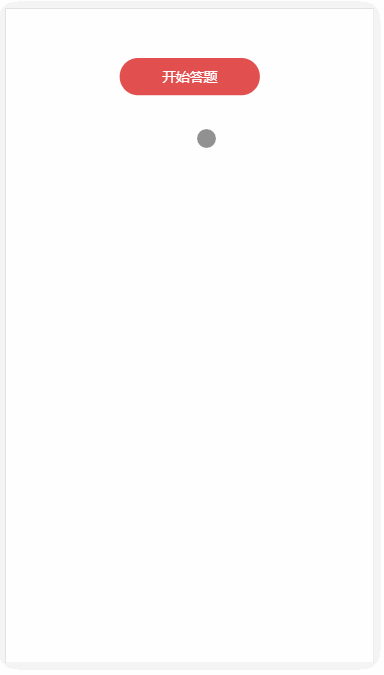

### vue答题小例子

> 利用vue + vuex + vue-router完成一个答题小例子

### 说明

> 邓小平爷爷说过实践是检验真理的唯一标准

> 学习vuex实践的小例子

> 欢迎各位大大提出问题, 该例子中的实现逻辑不是最好的, 但会一直去优化这个小例子

> 力争做好入门练习的例子, 给其他vue爱好入门者提供demo


### 运行
```
git clone git@github.com:YangAlas/vuex-subject.git

cd vuex-subject

npm install

npm run dev

```


### 预览


